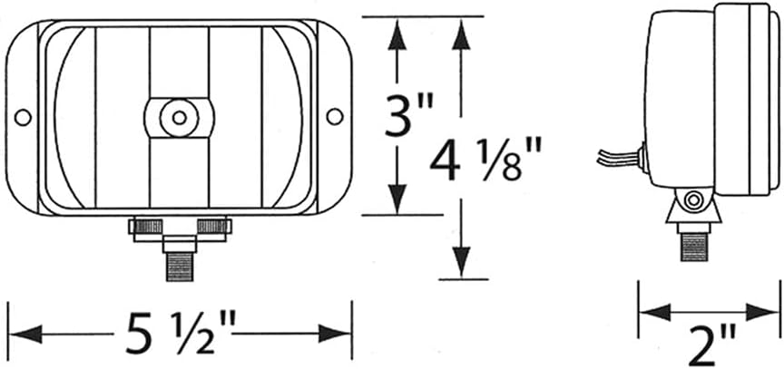

## Cold Start Misfire
- Intake Manifold Gasket leak (could close up due to heat)
    - Brake Cleaner on manifold on start
- minimal coolant seapage into a cylinder -> Doubt because first 10 seconds run fine. + recent rebuild -> but could have happend because of overpressure of coolant
- Choke not closing properly
- Distributor rebuilding -> youtube video

### Gameplan
1) brake cleaner on intake gasket + Carb rubbers -> X
2) clean and gap sparkplugs -> X
3) after 12 hours -> add oil then start, see if clunking goes away (i suspect oil pressure to come on too late)
4) Adjust Choke
5) Make car leaner -> MARK CURRENT FUEL SETTING
6) Rebuild Distributor
7) Buy a boroscope and check for coolant seapage into cylinders (cylinder 3 had minor  oil around the seal?)

## Top Engine
repaint valve cover with black wrinkel paint\
install timing belt cover\
look into what is vibriting and making that weird noise at 2k rpm -> Exhaust pipe

### Needed parts for this:
- black wrinkle paint

## Coolant
New Radiator\
Move Overflow tank (Should be tested first if it needs to be put on a higher position then the radiator cap so its easier to flow back into the radiator)\
new coolant\
correct thermostat\

### Needed parts for this:
- Radiator
- new radiator cap 1.1 bar

## Brakes
Scraping sound left front tyre\
squel when braking front tyres\
repaint callipers
Leaking brake fluid from master brake booster
New front brakes

## Suspension
Replace front suspension\
repaint shock tower black\
Replace all rubbers with polyuth rubber\

## Transmission
replace transmission fluid
relube and check speedo cable

### Needed parts for this:
- transmission fluid

## Body
fix sagging bumper front\
fix sagging bumper back\

### Needed parts for this:
- some hardware

## light
find foglights (some old bmw fog worked upside down look on fb page)\
repaint the name on stop lights

### Needed parts for this:
- foglights

## Interior
Properly mount back speakers? How?? -> driver side back is loose
find way so the radio cover doesn't vibrate as much\
install speaker louder maker thingy but test first\
install sunroof cover

## Exterior
wetsand, polish and buff paint

### Needed parts for this:
- extremly fine sandpaper ( 4K - 8K) for machine 

## Drivetrain
left wheel booth isnt'clamped enough

### Needed parts for this:
- special clamp

## Electrical
- High voltage alternator (when high beams are on the stop lights are almost gone) 90 - 93 Honda Accord alternator is plug and play, make sure its above 70amps, 94 honda accord also works but will need modification -> 93 2.3l prelude also works

BMW E30 sides body fit prelude

These fit:

13,97 centimeters - width
10.16 centimeters - all included height
7.62 centimeters -  fogligth height
5.08 centimeters - depth

Look into hella ->

https://www.amazon.com.be/-/nl/HELLA-Halogeen-Projector-groot-bereik/dp/B01IP8ULPM/ref=asc_df_B01IP8ULPM?mcid=1782b6e8c2de3a1b965fdd0dc308dfd5&hvadid=714424822216&hvpos=&hvnetw=g&hvrand=6806525626719323659&hvpone=&hvptwo=&hvqmt=&hvdev=c&hvdvcmdl=&hvlocint=&hvlocphy=9196181&hvtargid=pla-1212721563770&psc=1&language=nl_BE

Width: 19,5 cm - 
Height: 96 mm - 
Depth: 83 mm - 
Position depth: 18 mm -
Height space: 119 mm -

# Budget K Swap

Full transparency this is my first engine swap/install. This has been a 5 year mission. 

To cheaply go an build a BUDGET kswapped prelude. 

Then sell it to fund a dream build on my goldie prelude. I mainly used https://vtec.academy/budget-k-swap/ as a guide.
THERE ARE SOME GAPS HERE BUT THIS SHOULD GET YOU STARTED.

K24a4 w/ trans $200 accord shifter & cables included.

90-91 knuckles
Front Right Spindle Knuckle HONDA PRELUDE 90 US $85.00 ebay
Front Left Spindle Knuckle HONDA PRELUDE 90 US $85.00 ebay

2006 Honda Element Manual 5 Speed Engine Wire Harness Charge Harness US $135.00 ebay

Half Shaft - 07 08 09 10 11 HONDA CIVIC SI SEDAN 2.0L FRONT RIGHT PASSENGER SIDE JACK SHAFT US $120.94 ebay

Custom brackets from send cut send
REAR - $85 2 PIECE
DRIVER - $51
PASS - $95

Transmount $80 - https://jackspaniaracing. shop/products/k-series-k24-trans-transmission-mount-bracket-civic-94-01-integra-eg-accord-tsx?variant=46052822024417

CRV engine bracket junkyard cheap???

Engine Swap Mounts For Civic 92-95 Integra 94-01 K Series Swap K20 K24 62A Red US $185.00 only used the rubber mounts
Swivel coolant housing kswap $20-40 cant remember where/which one.
Driver axle (CAN'T FIND MY INFO ON THIS CURRENTLY, SORRY)
Passenger axle
TRQ Front Right CV Axle Shaft Assembly Passenger Side Compatible with 2004-2006 Acura TL 2003-2007 Honda Accord 2002-2006 CR-V $92
Acuity Throttle Position Sensor $115
Acuity TPS accord throttle body adapter $20 CUSTOM PART
K Series K Swap Ramhorn Header $450.00top half. Custom bottom half. BURTON RACING
Rywire conversion harness. $400+
Hondata ECU $1k (affirm financing is your friend)
Jackspania accord transmission bracket $80
Half shaft 07-11 civic si $120
Continental 52021 Flexible Coolant Hose, 1-1/4" x 20,Black $23
Upgr8 Universal 4-Ply High Performance 45 Degree Elbow Coupler Silicone Hose (1.25"(32MM), Black) $12
AEM 25-302BK Black High Volume Adjustable Fuel Pressure Regulator $143
Camco Heavy Duty Battery Box with Straps and Hardware - Group 24 |Safely Stores RV, Automotive, and Marine Batteries |Durable Anti-Corrosion Material | Measures 7-1/4" x 10-3/4" x 8" | (55363) $17
6 Gauge 6 AWG 25 Feet Red Welding Battery Pure Copper Flexible Cable Wire - Car, Inverter, RV, Solar by WindyNation $43
BLUE 2.5" 63.5 mm Inlet Cold Air Cone Replacement Performance Washable Clamp-On Dry Air Filter $17
HiSport Extension Harness 36'' 4 Wires for Upstream Downstream O2 Oxygen Sensor Compatible with Honda Acura Civic Integra Prelude $10
K-Swap Coolant Temperature Sender Sensor Adapter K20 K24 Engine Swap Fit for Honda Civic with Fittings Adaptor 3/8-1/8NPT $10
HPS 3/4" ID, Silicone 180 Degree U Bend Elbow Coupler Hose, High Temp 4-Ply Reinforced, Leg Length on Each Side: 4-1/2", 80 Psi Max. Pressure, SEC-8831-BLK, Silicone, Blue $32
Upper Coolant Housing Straight Inlet with Integrated Filler Neck for Honda K24 K20Z3 $54
