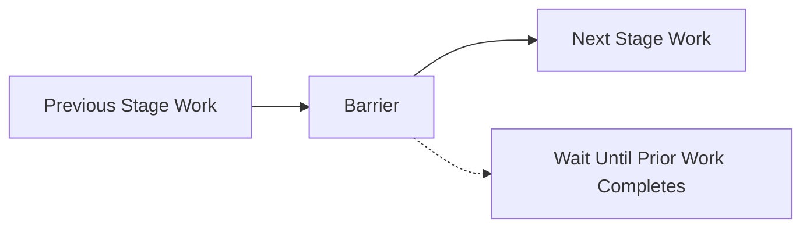

## Why Vulkan Barriers Are Challenging
Vulkan's explicit synchronization model gives developers fine-grained control over GPU operations, but with great power comes great responsibility. Unlike legacy APIs that handle synchronization automatically (often conservatively), Vulkan requires manual barrier management—a critical skill for performance optimization.

Get barriers wrong, and you risk:

- Undefined behavior (race conditions, GPU crashes)
- Performance bottlenecks (excessive stalls, cache flushes)
- Hidden costs (unnecessary resource decompression)

This guide demystifies pipeline barriers, their GPU-side effects, and best practices for optimal rendering.
What Pipeline Barriers Actually Do

A Vulkan barrier (vkCmdPipelineBarrier) enforces three key GPU operations:
### 1. Execution Stall (Pipeline Drain)

Example: Fragment shader reads a texture after it’s rendered to. The GPU must finish all fragment/ROP work before the read begins.

### 2. Cache Flush/Invalidation

Why? Caches are stage-specific (e.g., fragment shader vs. transfer engine). Barriers ensure memory coherence.

### 3. Resource Decompression (Costly!)

   MSAA textures may decompress during layout transitions (e.g., `COLOR_ATTACHMENT_OPTIMAL` → `SHADER_READ_ONLY_OPTIMAL`).

   Mobile GPUs often use tile-based rendering with compressed formats.