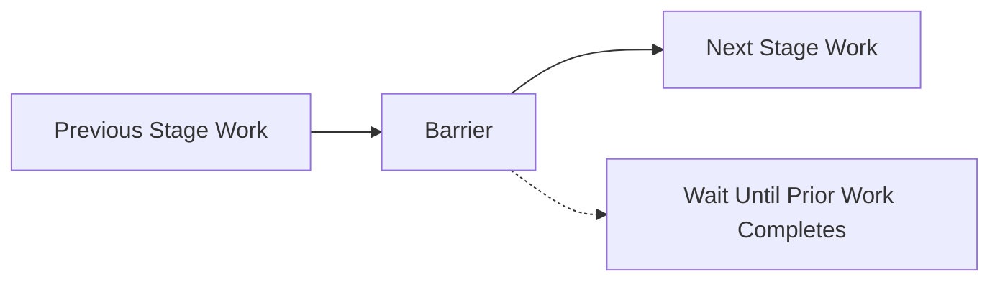
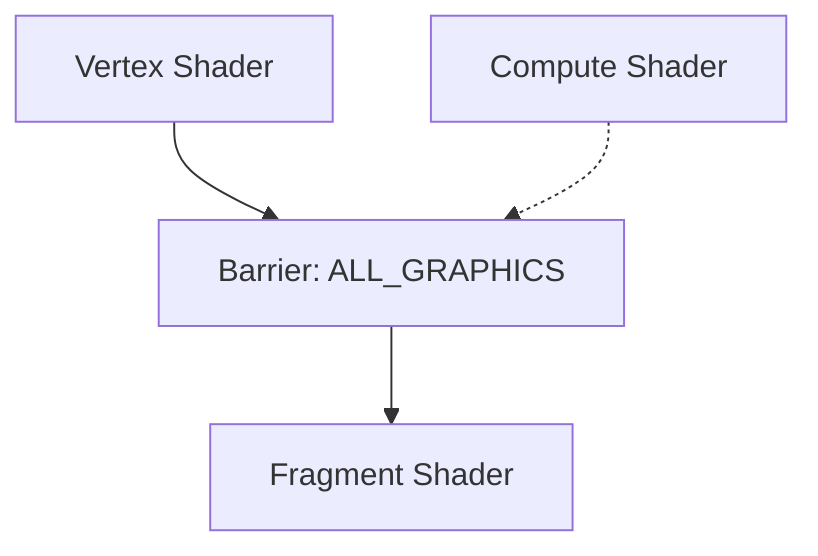
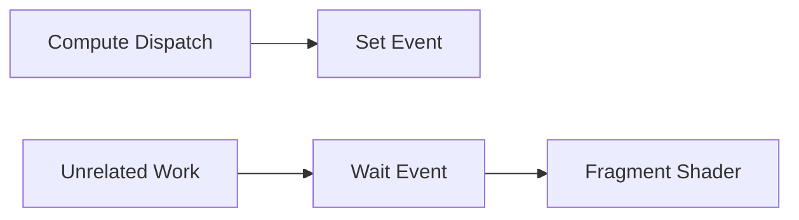

## Why Vulkan Barriers Are Challenging
Vulkan's explicit synchronization model gives developers fine-grained control over GPU operations, but with great power comes great responsibility. Unlike legacy APIs that handle synchronization automatically (often conservatively), 

Get barriers wrong, and you risk:

- Undefined behavior (race conditions, GPU crashes)
- Performance bottlenecks (excessive stalls, cache flushes)
- Hidden costs (unnecessary resource decompression)

This guide demystifies pipeline barriers, their GPU-side effects, and best practices for optimal rendering.
What Pipeline Barriers Actually Do

A Vulkan barrier (vkCmdPipelineBarrier) enforces three key GPU operations:
### 1. Execution Stall (Pipeline Drain)

Example: Fragment shader reads a texture after it’s rendered to. The GPU must finish all fragment/ROP work before the read begins.


### 2. Cache Flush/Invalidation

Why? Caches are stage-specific (e.g., fragment shader vs. transfer engine). Barriers ensure memory coherence.


### 3. Resource Decompression (Costly!)

   MSAA textures may decompress during layout transitions (e.g., `COLOR_ATTACHMENT_OPTIMAL` → `SHADER_READ_ONLY_OPTIMAL`).

   Mobile GPUs often use tile-based rendering with compressed formats.

## Barrier Types and GPU Impact
### 1. Execution Barriers
Controls when stages execute. Over-synchronization serializes work:

Problem: `ALL_GRAPHICS` forces vertex + fragment to run sequentially.
Fix: Use precise stage masks (e.g., `COLOR_ATTACHMENT_OUTPUT` → `FRAGMENT_SHADER`).

### 2. Memory Barriers

Ensures correct data visibility. Missing barriers cause hazards:
```cpp
vkCmdPipelineBarrier(  
    srcStage = VK_PIPELINE_STAGE_COMPUTE_SHADER_BIT,  
    dstStage = VK_PIPELINE_STAGE_FRAGMENT_SHADER_BIT,  
    srcAccess = VK_ACCESS_SHADER_WRITE_BIT,  // Compute wrote  
    dstAccess = VK_ACCESS_SHADER_READ_BIT    // Fragment reads  
);  
```

### 3. Layout Transitions

Performance Tip: Avoid redundant transitions (e.g., don’t transition depth buffers if unused later).


## Best Practices for Optimal Barriers
### 1. Batch Barriers
Bad: Multiple vkCmdPipelineBarrier calls.\
Good: Single call with all barriers.

### 2. Precisely Specify Stages
```cpp
// Over-synchronized (BAD):  
dstStageMask = VK_PIPELINE_STAGE_ALL_GRAPHICS_BIT;  

// Optimized (GOOD):  
dstStageMask = VK_PIPELINE_STAGE_FRAGMENT_SHADER_BIT;  
```

### 3. Prefer Split Barriers
Use `vkCmdSetEvent` + `vkCmdWaitEvents` to hide latency:


> ##### Warning
>
> Only use split barriers when you can commit enough work between the set and wait events
{: .block-warning }


### 4. Tile-Based GPU Considerations

Mobile GPUs parallelize vertex/fragment work:\
Bad: `VERTEX_SHADER` → `FRAGMENT_SHADER` barriers serialize pipelines.\
Good: `COLOR_ATTACHMENT_OUTPUT` → `FRAGMENT_SHADER` allows overlap

