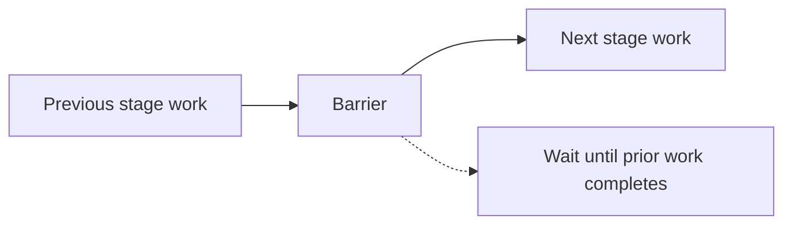
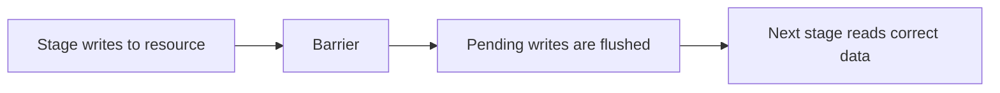
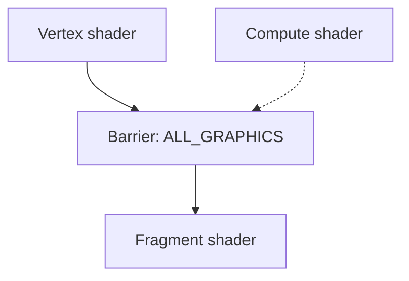
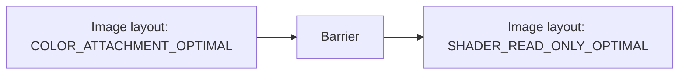
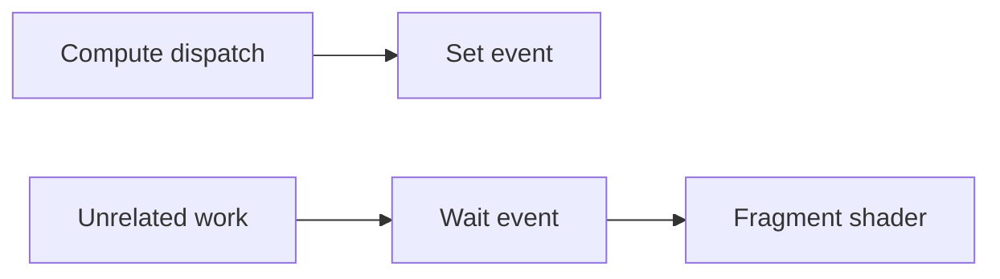

## Why Vulkan barriers are challenging

Vulkan's explicit synchronization model gives you fine-grained control over GPU operations, but with great power comes great responsibility. Older APIs like OpenGL and DirectX 11 track resource usage for you, and they often synchronize conservatively to be safe. In Vulkan, **you** have to tell the driver how every resource is used and when that usage changes. That's what pipeline barriers are for.

Get barriers wrong, and you risk:

- **Undefined behavior:** reading half-written data, corrupted images, validation errors or device loss.
- **Performance bottlenecks:** the GPU waiting on work that didn't need to be waited on.
- **Hidden costs:** expensive work in the driver, like resolving or decompressing images, that you didn't ask for.

This guide explains what pipeline barriers do on the GPU side, and the best practices for using them.

> Turn on the **synchronization validation** layer (`VK_LAYER_KHRONOS_validation` with *Synchronization* enabled, e.g. through `vkconfig`). It catches most missing or wrong barriers for you.
{: .block-tip }

## What pipeline barriers actually do

A barrier is recorded with `vkCmdPipelineBarrier` (or `vkCmdPipelineBarrier2` from *Synchronization2*, which is core since Vulkan 1.3). It says: *"this resource was used by these stages in this way, and will next be used by these stages in that way."*

Based on that information, the driver can do three things:

### 1. Wait for earlier work (pipeline drain)


```mermaid
flowchart LR
    A[Previous stage work] --> B[Barrier] --> C[Next stage work]
    B -.-> D[Wait until prior work completes]
```

**Example:** a fragment shader samples a texture that was just rendered to in a previous render pass. The GPU must finish *all* rendering to that texture before the read begins, otherwise the shader could read an incomplete image.

### 2. Make sure data is visible


```mermaid
flowchart LR
    A[Stage writes to resource] --> B[Barrier] --> C[Pending writes are flushed]
    C --> D[Next stage reads correct data]
```

**Why?** Drivers and GPUs don't always write to memory immediately. Data can be buffered or kept in stage-specific storage (for example on-chip tile memory on a mobile GPU). The barrier is the point where the driver guarantees that everything written before it is visible to the stages after it.

### 3. Convert the resource (can be costly!)

Image **layout transitions** (e.g. `COLOR_ATTACHMENT_OPTIMAL` → `SHADER_READ_ONLY_OPTIMAL`) tell the driver how the image will be accessed next. Depending on the driver, that can mean real work, for example:

- Decompressing a framebuffer that the driver stored in a compressed form, like Arm's AFBC on Mali GPUs.
- Resolving or copying data so it can be sampled.

> A layout transition is **not** always free. Transitioning back and forth between layouts every frame can cost more than you'd expect, especially on mobile.
{: .block-warning }

## Barrier types and their GPU impact

### 1. Execution barriers

The stage masks control *which work has to wait for which*. Masks that are too broad over-synchronize, which serializes work that could have run in parallel:


```mermaid
flowchart TD
    A[Vertex shader] --> B[Barrier: ALL_GRAPHICS]
    B --> C[Fragment shader]
    D[Compute shader] -.-> B
```

**Problem:** `VK_PIPELINE_STAGE_ALL_GRAPHICS_BIT` says *any* graphics stage may depend on the resource, so the driver has to be conservative.

**Fix:** use precise stage masks that match how the resource is really used (e.g. `COLOR_ATTACHMENT_OUTPUT` → `FRAGMENT_SHADER`).

### 2. Access barriers

Access masks tell the driver *how* the resource was used and will be used. Missing or wrong ones cause hazards like reading data that is still being written.

A common example: a compute shader writes to a storage image, and afterwards a fragment shader samples it.

```cpp
VkImageMemoryBarrier2 barrier{
    .sType               = VK_STRUCTURE_TYPE_IMAGE_MEMORY_BARRIER_2,
    .srcStageMask        = VK_PIPELINE_STAGE_2_COMPUTE_SHADER_BIT,  // Compute wrote...
    .dstStageMask        = VK_PIPELINE_STAGE_2_FRAGMENT_SHADER_BIT, // ...fragment will read
    .srcAccessMask       = VK_ACCESS_2_SHADER_STORAGE_WRITE_BIT,
    .dstAccessMask       = VK_ACCESS_2_SHADER_SAMPLED_READ_BIT,
    .oldLayout           = VK_IMAGE_LAYOUT_GENERAL,                 // Storage images use GENERAL
    .newLayout           = VK_IMAGE_LAYOUT_SHADER_READ_ONLY_OPTIMAL,
    .srcQueueFamilyIndex = VK_QUEUE_FAMILY_IGNORED,
    .dstQueueFamilyIndex = VK_QUEUE_FAMILY_IGNORED,
    .image               = image,
    .subresourceRange    = { VK_IMAGE_ASPECT_COLOR_BIT, 0, 1, 0, 1 },
};

VkPipelineBarrierInfo info{
    .sType                   = VK_STRUCTURE_TYPE_PIPELINE_BARRIER_INFO,
    .imageMemoryBarrierCount = 1,
    .pImageMemoryBarriers    = &barrier,
};

vkCmdPipelineBarrier2(commandBuffer, &info);
```

> With the original `vkCmdPipelineBarrier`, the stage masks are passed to the function and apply to **all** barriers in that call. With `vkCmdPipelineBarrier2`, every barrier has its own stage masks, which makes precise masks much easier. Prefer *Synchronization2* when you can.
{: .block-info }

### 3. Layout transitions


```mermaid
flowchart LR
    A[Image layout: COLOR_ATTACHMENT_OPTIMAL] --> B[Barrier]
    B --> C[Image layout: SHADER_READ_ONLY_OPTIMAL]
```

**Performance tip:** avoid redundant transitions. For example, don't transition a depth buffer to a readable layout if nothing reads it afterwards.

> If you don't care about the current contents of an image (for example, you are about to clear it or overwrite it completely), use `VK_IMAGE_LAYOUT_UNDEFINED` as the `oldLayout`. This tells the driver it may **discard** the old data instead of preserving it.
{: .block-tip }

## Best practices for optimal barriers

### 1. Batch barriers

**Bad:** a separate barrier call for every image.  
**Good:** one call with all barriers that happen at the same point in time.

Both functions take *arrays* of barriers. Batching gives the driver the full picture at once, so it can merge the work.

### 2. Precisely specify stages

```cpp
// Over-synchronized (BAD)
barrier.dstStageMask = VK_PIPELINE_STAGE_2_ALL_GRAPHICS_BIT;

// Precise (GOOD)
barrier.dstStageMask = VK_PIPELINE_STAGE_2_FRAGMENT_SHADER_BIT;
```

### 3. Consider split barriers

Instead of one barrier that blocks right away, you can split the wait in two with a `VkEvent`: `vkCmdSetEvent` marks when the earlier work is done, and `vkCmdWaitEvents` waits for it only when the result is actually needed. Unrelated work can keep running in the meantime, which hides the latency:


```mermaid
flowchart LR
    A[Compute dispatch] --> B[Set event]
    C[Unrelated work] --> D[Wait event] --> E[Fragment shader]
```

> Only use split barriers when you can record enough **unrelated** work between setting and waiting on the event. Otherwise you only add overhead. Always profile on your target hardware, because not every driver benefits from this.
{: .block-warning }

### 4. Tile-based GPU considerations

Mobile GPUs are usually **tile-based**: they first process the geometry of a render pass (binning), and then render the fragments tile by tile. They get their performance from being able to overlap these phases across frames.

- **Bad:** `VERTEX_SHADER` → `FRAGMENT_SHADER` barriers. These force the phases to run one after another.
- **Good:** `COLOR_ATTACHMENT_OUTPUT` → `FRAGMENT_SHADER`, which allows them to overlap.

> On tile-based GPUs, reading back a render target in the **same** frame (e.g. sampling it in a later pass) can force the driver to flush the whole tile pipeline. Where possible, use subpasses or input attachments instead so the data can stay in on-chip memory.
{: .block-info }
